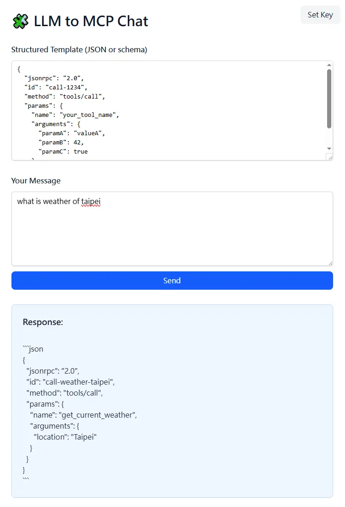

# Context Engineer MCP demo

open page: http://homun.posetmage.com/mcp-context-engineering/

Set your google gemini key

Type MCP json template as example

ask AI question, get MCP structure output

